# Loopo:443 — an AstroPaper fork 📄

> This repository is a personal fork of
> [AstroPaper](https://github.com/satnaing/astro-paper) (v6.1) by
> [Sat Naing](https://satnaing.dev). It keeps the theme's look and feel and adds
> an optional self-hosted comment/account service, article analytics, an emoji
> system, a post sidebar, KaTeX support and CJK-aware share images. See
> [`docs/fork-feature-review.md`](docs/fork-feature-review.md) for what changed
> and how it fits the upstream design, and
> [`docs/comments-and-account.md`](docs/comments-and-account.md) for the service
> specification.


[](https://www.figma.com/community/file/1356898632249991861)


[](https://conventionalcommits.org)
[](http://commitizen.github.io/cz-cli/)

AstroPaper is a minimal, responsive, accessible and SEO-friendly Astro blog theme. This theme is designed and crafted based on [my personal blog](https://satnaing.dev/blog).

Read [the blog posts](https://astro-paper.pages.dev/posts/) or check [the README Documentation Section](#-documentation) for more info.

## 🔥 Features

- [x] type-safe markdown
- [x] super fast performance
- [x] accessible (Keyboard/VoiceOver)
- [x] responsive (mobile ~ desktops)
- [x] SEO-friendly
- [x] light & dark mode
- [x] static search ([Pagefind](https://pagefind.app/))
- [x] draft posts & pagination
- [x] sitemap & rss feed
- [x] MDX support
- [x] 文章侧栏目录与标签云
- [x] followed best practices
- [x] highly customizable
- [x] dynamic OG image generation for blog posts ([Blog Post](https://astro-paper.pages.dev/posts/dynamic-og-image-generation-in-astropaper-blog-posts/))
- [x] i18n ready
- [x] 文章侧栏目录与标签云
- [x] comments with threaded replies, edits, deletion and emoji (`backends/`)
- [x] accounts and notification preferences (OIDC login via the SM identity provider)
- [x] article view analytics (3-hour per-visitor dedupe) and footer site statistics
- [x] KaTeX math, image captions and callouts
- [x] QQ/WeChat share images and HotLinks
- [x] signed content notifications from Git hooks and GitHub Actions

_Note: I've tested screen-reader accessibility of AstroPaper using **VoiceOver** on Mac and **TalkBack** on Android. I couldn't test all other screen-readers out there. However, accessibility enhancements in AstroPaper should be working fine on others as well._

## ✅ Lighthouse Score

<p align="center">
  <a href="https://pagespeed.web.dev/report?url=https%3A%2F%2Fastro-paper.pages.dev%2F&form_factor=desktop">
    
  </a>
</p>

## 🚀 Project Structure

Inside of AstroPaper, you'll see the following folders and files:

```bash
/
├── backends/              # optional comments/accounts API (Fastify + PostgreSQL)
├── docs/                  # fork-specific specification and review notes
├── public/
│   ├── pagefind/          # auto-generated on build
│   ├── favicon.svg
│   └── default-og.png
├── src/
│   ├── assets/
│   │   ├── icons/
│   │   └── images/
│   ├── components/
│   ├── data/
│   │   └── hotlinks.json  # home page avatar links
│   ├── content/
│   │   ├── pages/
│   │   │   └── about.md
│   │   └── posts/
│   │       └── some-blog-posts.md
│   ├── i18n/
│   ├── layouts/
│   ├── pages/
│   ├── scripts/
│   ├── styles/
│   ├── types/
│   ├── utils/
│   ├── config.ts
│   └── content.config.ts
├── scripts/               # emoji manifest, content notifications, hook install
├── .githooks/             # local content-notification hooks (optional)
├── .env.example           # site environment variables (optional)
├── astro-paper.config.ts  # user-defined configurations
└── astro.config.ts
```

All blog posts are stored in the `src/content/posts/` directory. You can organise posts into subdirectories — the subdirectory name becomes part of the post URL.

With `features.dynamicOgImage` enabled, QQ's non-OG `itemprop="image"` uses a
separate 1200×1200 share image (`/qq.png` for the site and
`/posts/<slug>/qq.png` for articles). The image generator's `"qq"` target fits
the complete title on one line using the actual font width. Open Graph,
Twitter, and WeChat continue to use the existing landscape images. Article
QQ images are also generated for posts with a custom `ogImage`.

## 首页 HotLinks

首页在 Social Links 右侧显示 HotLinks，头像列表由 `src/data/hotlinks.json` 在构建时生成，按数组顺序排列。文件提供一个示例条目，可按实际需求替换或新增。

每个条目包含 `name`（链接名称）、`url`（目标地址）、`avatar`（头像地址）。`avatar` 支持 `hotlinks/example.png`、`/hotlinks/example.png` 等相对地址，也支持完整的外部图片 URL；本地图片放在 `public/` 目录中。头像使用 32px 圆形裁切，点击区域为 40px，链接在新标签页打开。两组链接之间保留间距，窄屏自动换行；空数组会隐藏 HotLinks。修改 JSON 后重新构建即可更新网站。

## 📖 Documentation

This fork removes the upstream posts that doubled as documentation, so the
theme guides now live upstream:

- Configuration - [blog post](https://astro-paper.pages.dev/posts/how-to-configure-astropaper-theme/)
- Add Posts - [blog post](https://astro-paper.pages.dev/posts/adding-new-posts-in-astropaper-theme/)
- Customize Color Schemes - [blog post](https://astro-paper.pages.dev/posts/customizing-astropaper-theme-color-schemes/)
- Predefined Color Schemes - [blog post](https://astro-paper.pages.dev/posts/predefined-color-schemes/)

Fork-specific documentation:

- Comments, accounts and notifications - [docs/comments-and-account.md](docs/comments-and-account.md)
- Comments API, migrations and deployment - [backends/README.md](backends/README.md)
- New features, design fit and known gaps - [docs/fork-feature-review.md](docs/fork-feature-review.md)

## 💻 Tech Stack

**Main Framework** - [Astro](https://astro.build/)  
**Type Checking** - [TypeScript](https://www.typescriptlang.org/)  
**Styling** - [TailwindCSS](https://tailwindcss.com/)  
**UI/UX** - [Figma Design File](https://www.figma.com/community/file/1356898632249991861)  
**Static Search** - [Pagefind](https://pagefind.app/)  
**Icons** - [Tablers](https://tabler-icons.io/)  
**Code Formatting** - [Prettier](https://prettier.io/)  
**Deployment** - [Cloudflare Pages](https://pages.cloudflare.com/)  
**Linting** - [ESLint](https://eslint.org)  
**Dynamic OG images** - [Satori](https://github.com/vercel/satori) + [Sharp](https://sharp.pixelplumbing.com/) + [Astro Fonts](https://docs.astro.build/en/guides/fonts/)

## 👨🏻‍💻 Running Locally

Clone this repository (the published AstroPaper template does **not** include the
comment service, analytics or emoji system):

```bash
git clone https://github.com/OsakaLOOP/astro-paper.git
cd astro-paper

# install dependencies
pnpm install

# optional: point the site at your own API origin
cp .env.example .env

# start the dev server
pnpm dev
```

The site is fully static and builds without the backend; comments, accounts,
view counts and the footer statistics simply degrade until an API is reachable.
To run the API as well, see [`backends/README.md`](backends/README.md).

## Google Site Verification (optional)

You can add your [Google Site Verification HTML tag](https://support.google.com/webmasters/answer/9008080#meta_tag_verification&zippy=%2Chtml-tag) by setting `site.googleVerification` in `astro-paper.config.ts`:

```ts file="astro-paper.config.ts"
export default defineAstroPaperConfig({
  site: {
    // ...
    googleVerification: "your-google-site-verification-value",
  },
  // ...
});
```

> See [this discussion](https://github.com/satnaing/astro-paper/discussions/334#discussioncomment-10139247) for adding AstroPaper to the Google Search Console.

## 🔧 Environment variables

Site variables live in `.env` (see [`.env.example`](.env.example)) and are
declared in the `env.schema` of `astro.config.ts`:

| Variable                          | Default                | Purpose                                        |
| :-------------------------------- | :--------------------- | :--------------------------------------------- |
| `PUBLIC_BLOG_API`                 | `https://api.loopo.cc` | Origin of the comments/accounts API            |
| `PUBLIC_COMMENTS_DEBUG`           | `false`                | Log `[comments]` traces to the browser console |
| `PUBLIC_GOOGLE_SITE_VERIFICATION` | –                      | Google Search Console verification meta tag    |

The backend keeps its own secrets in `backends/.env` (see
[`backends/.env.example`](backends/.env.example)).

## 🧞 Commands

All commands are run from the root of the project, from a terminal:

| Command               | Action                                                                                                                           |
| :-------------------- | :------------------------------------------------------------------------------------------------------------------------------- |
| `pnpm install`        | Installs dependencies                                                                                                            |
| `pnpm dev`            | Starts local dev server at `localhost:4321`                                                                                      |
| `pnpm build`          | Type-checks, builds the site, runs Pagefind indexing, and copies the index to `public/pagefind/`                                 |
| `pnpm preview`        | Preview your build locally, before deploying                                                                                     |
| `pnpm sync`           | Generates TypeScript types for all Astro modules. [Learn more](https://docs.astro.build/en/reference/cli-reference/#astro-sync). |
| `pnpm astro ...`      | Run CLI commands like `astro add`, `astro check`                                                                                 |
| `pnpm emoji:generate` | Regenerate `public/emoji/manifest.json` from `public/emoji/<group>/`                                                             |
| `pnpm emoji:rename`   | Rename emoji assets to their stable `<group>_<suffix>` identifiers, then regenerate the manifest                                 |
| `pnpm hooks:install`  | Point `core.hooksPath` at `.githooks/` for local content notifications                                                           |

## ✨ Feedback & Suggestions

If you have any suggestions/feedback, you can contact me via [my email](mailto:satnaingdev+astropaper@gmail.com). Alternatively, feel free to open an issue if you find bugs or want to request new features.

## 📜 License

Licensed under the MIT License, Copyright © 2026

---

Made with 🤍 by [Sat Naing](https://satnaing.dev) 👨🏻‍💻 and [contributors](https://github.com/satnaing/astro-paper/graphs/contributors).
