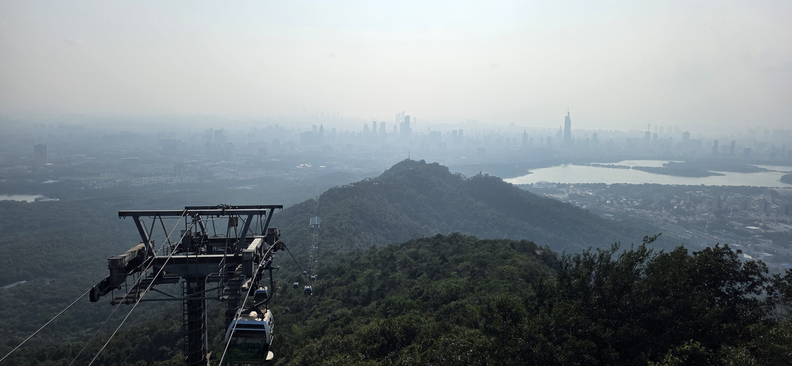
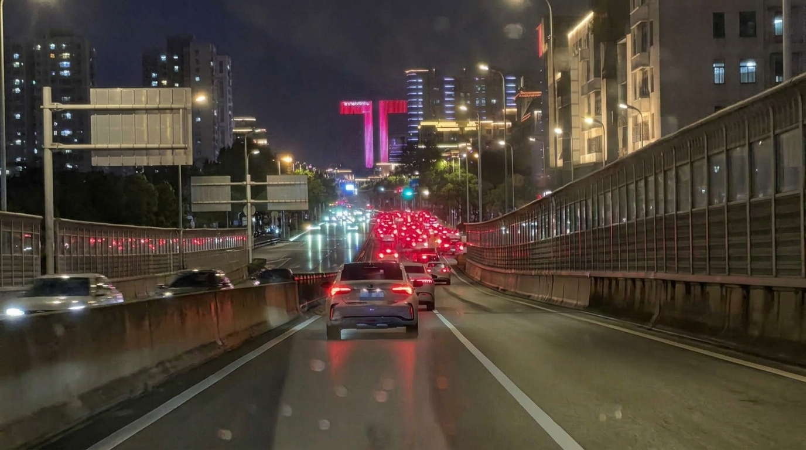
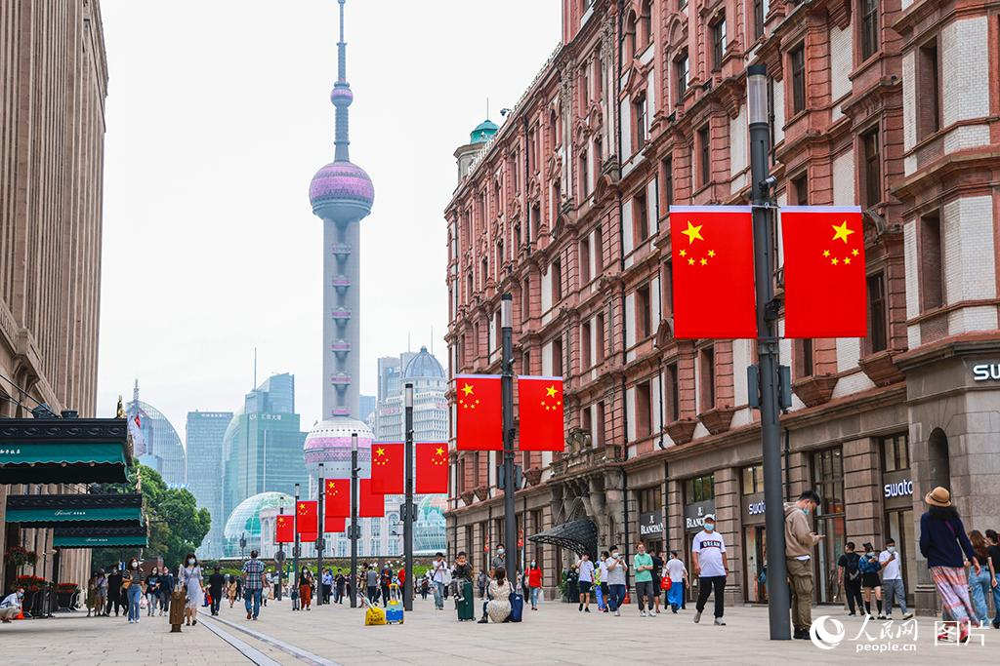

中秋三天就这么稀里糊涂地过来了, day1 和小团体爬紫金山唱k, day2 和朋友在家吃寿喜锅, day3 睡到昏死并补作业.

国庆呢? 我认为比较合理的时间分配是回家三天两晚, 自己待五天, 于是订了3号走5号回的票; 我妈则认为我在电话里告诉她30号下午4点放学等价于同意她这个时候来接, 所以现在我正坐在家里写这个 post. 本来就没啥计划, 现在更不知道干什么了.

等回南京, 大概会按随机顺序进行包括但不限于以下活动:

[x] 骑车到栖霞山, 6号线进城到城北万象汇, 转7号线晓庄, 转1号线八卦洲大桥南, 在此之前不必考虑怎么回来.
[ ] 挑战0消费逛德基奥莱
[ ] 出勤
[ ] 做饭
[x] 看番看漫画看本子
[x] 写 blog
[ ] 复习数物期中
[x] 打搅

以上。

国庆快乐!
